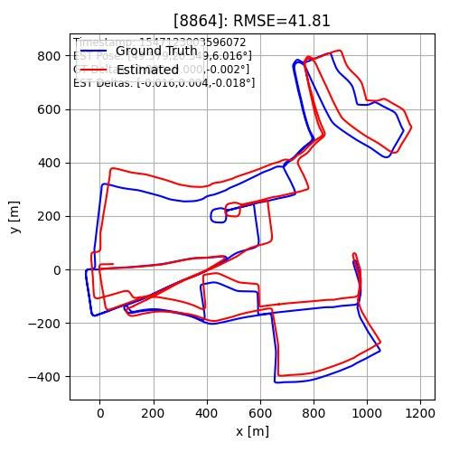

# RAW-ROAM: Really Adverse Weather-Radar Odometry and Mapping (Python reimplementation of RadarSLAM)

A Python reimplementation of odometry and mapping component of RadarSLAM by Hong et al. [1,2].

Final Paper: [**RAW-ROAM: An Open-Source Implementation of Adverse Weather RadarSLAM**](https://github.com/Samleo8/RadarSLAMPy/blob/master/raw-roam.pdf)

## Results (Odometry)

With Motion Compensation



Without Motion Compensation:


## Running Code

Requires Python. Tested on Python >= 3.9.

```bash
pip install -r requirements.txt
python3 RawROAMSystem.py <DATASET_NAME> [START_FRAME_IND [END_FRAME_IND]]
```

### Radar Sequences

Radar sequences can be obtained from [Oxford Radar RobotCar Dataset](https://oxford-robotics-institute.github.io/radar-robotcar-dataset/datasets) and should be placed in the `./data` folder. The folder organization listed as `full_seq_1` is an example of how the directory looks like, and is taken from the [`10-11-46-21` sequence](https://oxford-robotics-institute.github.io/radar-robotcar-dataset/datasets/2019-01-10-11-46-21-radar-oxford-10k).

## Documentation

See the docs:

- [HTML](./doc/html/index.html)
- [PDF](./doc/latex/refman.pdf)

## Relevant Papers

 1. [RadarSLAM (2021)](https://arxiv.org/abs/2104.05347)
 2. [RadarSLAM (2020)](https://arxiv.org/abs/2005.02198)
 3. [PhaRaO](https://ieeexplore.ieee.org/document/9197231)
